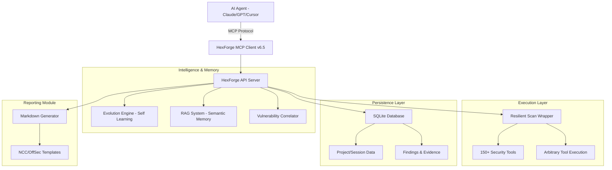

<div align="center">


# HexForge v6.5
### AI-Powered Autonomous Cybersecurity Platform with Persistence, RAG & Evolution

[](https://www.python.org/)
[](LICENSE)
[](https://github.com/adibirzu/hexforge)
[](https://github.com/adibirzu/hexforge)
[](https://github.com/adibirzu/hexforge)

**Advanced AI-powered autonomous penetration testing framework with persistent storage, semantic search (RAG), and a self-evolving tool execution engine.**

[🚀 Installation](#installation) • [🏗️ Architecture](#architecture-overview) • [🧬 Evolution Engine](#evolution-engine) • [📝 Reporting](#reporting) • [🤖 AI Agents](#ai-agents) • [📡 API Reference](#api-reference-v2)

</div>

---

## What's New in v6.5

HexForge v6.5 introduces significant architectural upgrades focused on autonomy, persistence, and intelligence:

*   **🧬 Evolution Engine**: Dynamically learn and execute any command-line tool on the system.
*   **💾 Persistent Layer**: SQLite-backed storage for projects, sessions, scans, and findings.
*   **🧠 RAG Integration**: Semantic search across past findings using ChromaDB and vector embeddings.
*   **🔄 Checkpoint System**: Resume long-running scans from the last saved state.
*   **📊 Pro Reporting**: Automated generation of professional pentesting reports (NCC Group & OffSec styles).
*   **⚡ Token Optimization**: Intelligent context compression and incremental updates to save LLM tokens.

---

## Architecture Overview

HexForge features a multi-layered autonomous architecture inspired by NeuroSploit and Pentest-AI.



---

## Installation

### Automated Setup (Recommended)

The easiest way to install HexForge and all its dependencies (including core security tools) is using the automated installer:

```bash
git clone https://github.com/adibirzu/hexforge.git
cd hexforge
chmod +x install.sh
./install.sh
```

The installer will:
1. Create necessary directory structures.
2. Set up a Python virtual environment.
3. Install all dependencies (including RAG and ML libraries).
4. Initialize the persistent SQLite database.
5. Check and install missing security tools (requires sudo).

---

## Evolution Engine

HexForge can now "evolve" by learning new tools on the fly. If you have a custom security tool installed, HexForge can learn how to use it autonomously.

1. **Discovery**: AI triggers `learn_new_tool("mytool")`.
2. **Learning**: HexForge reads the man pages, help menus, and version info.
3. **Execution**: AI uses `execute_arbitrary_tool("mytool", ["--flag", "target"])`.
4. **Correlation**: Outputs are automatically correlated to suggest the next attack vector.

---

## Reporting

Generate professional reports directly from your workspace findings:

```bash
# Via MCP Tool
generate_report(project_id="uuid", template="ncc")
```

Available Templates:
*   `standard`: Comprehensive HexForge assessment.
*   `ncc`: Inspired by NCC Group's technical report style.
*   `offsec`: Inspired by Offensive Security's penetration test style.

---

## API Reference (v2)

### Projects & Sessions
| Endpoint | Method | Description |
|----------|--------|-------------|
| `/api/v2/projects` | POST | Create a new security project |
| `/api/v2/projects` | GET | List all projects |
| `/api/v2/sessions` | POST | Start a tracked session |

### Evolution & Execution
| Endpoint | Method | Description |
|----------|--------|-------------|
| `/api/v2/evolution/learn` | POST | Dynamically learn a system tool |
| `/api/v2/evolution/execute` | POST | Execute any tool with auto-correlation |
| `/api/v2/evolution/learned` | GET | List all learned tools |

### RAG & Intelligence
| Endpoint | Method | Description |
|----------|--------|-------------|
| `/api/v2/rag/query` | POST | Semantic search across findings |
| `/api/v2/rag/context` | POST | Get enriched context for a target |

---

## Security Considerations

⚠️ **Important Security Notes**:
- **Isolated Environments**: Always run HexForge in a dedicated security testing VM (Kali Linux recommended).
- **Tool Oversight**: AI agents can execute powerful system tools; monitor the real-time dashboard.
- **Data Protection**: Sensitive findings are stored locally in `data/hexstrike.db`. Ensure this directory is protected.

### Legal & Ethical Use
HexForge is intended for **authorized penetration testing** and **security research** only. Unauthorized use against systems you do not own or have explicit permission to test is illegal.

---

## Fleet hosts and operator cutover

Canonical product is **HexForge** in **this** repo (`adibirzu/hexforge`, v6.5). It is not `0x4m4/hexstrike-ai` and it is not `/home/adi/GitHub/hexstrike-ai`.
Named hosts, the `:8888` → `:8889` operator cutover, and KaliVM access status live in [`deploy/FLEET.md`](deploy/FLEET.md).

On adi1, start HexForge without touching the live QLoRA clone:

```bash
deploy/run-operator.sh          # binds :8889 when :8888 is already taken
curl -sS http://127.0.0.1:8889/health/identity
```

The API binds to `127.0.0.1` by default; set `HEXSTRIKE_HOST` only when remote
access is intentional. For a local companion with command execution disabled,
set `AETHEROPS_LAB=1`. This lab profile returns 404 for `/api/command`,
`/api/payloads/generate`, and `/api/v2/evolution/execute`, and omits the
`execute_command` and `generate_payload` MCP tools.

`/health` and `/health/identity` must show `product: "HexForge"`, `version: "6.5.0"`, `edition: "hexforge"`, and the v2 modules (persistence, rag, checkpoint, optimizer, evolution, reporting). Legacy HexStrike v6.0 reports `6.0.0` and has no `/api/v2/*`.

## KaliVM Execution Host (deploy/)

Reproducible provisioning for the fleet's Kali VM pentest host. Every host,
user, key, and binary location is a variable - nothing is hardcoded.

| File | Purpose |
|---|---|
| `FLEET.md` | Named hosts, operator port cutover, KaliVM access, QLoRA isolation. |
| `run-operator.sh` | Start v6.5 on adi1. Never kills an existing listener; never runs from the training clone. |
| `bootstrap-kali.sh` | Idempotent prerequisite installer: apt layer, PATH repairs, pinned Go tools, optional extras. Exits nonzero if any core tool is still missing. Run with `sudo` on the VM. |
| `kali-inventory.sh` | Emits a JSON manifest of the toolchain (OS, arch, kernel, package count, per-tool path + version). Redirect to `kali-tools-<date>.json` to snapshot. |
| `remote-run.sh` | Drives either script over the SSH jump chain from an operator host (`bootstrap` / `inventory` aliases accepted). |
| `kali-tools-2026-08-25.json` | Captured inventory: 49/50 tools present on arm64 Kali Rolling. |

### Quick start

```bash
# From an operator host with jump access:
KALI_USER=adi KALI_HOST=kali.cyber-sec.ro KALI_JUMP_HOST=adi@adi1 \
  deploy/remote-run.sh deploy/bootstrap-kali.sh

# Snapshot the toolchain afterwards:
KALI_USER=adi KALI_HOST=kali.cyber-sec.ro KALI_JUMP_HOST=adi@adi1 \
  deploy/remote-run.sh deploy/kali-inventory.sh > deploy/kali-tools-$(date +%F).json
```

Overrides: `GO_BIN_DIR`, `INSTALL_OPTIONAL`, `APT_UPDATE`, `SUDO`, `KALI_*`.
Go tools are version-pinned in `GO_TOOLS_PINNED` for deterministic builds.

---

## Author
**adibirzu** - [GitHub](https://github.com/adibirzu)

HexForge is an independent product. It reused early HexStrike history but is **not** `0x4m4/hexstrike-ai`. Original HexStrike v6.0 author: **m0x4m4**.

---

**Made with ❤️ for the AI Security Community**
