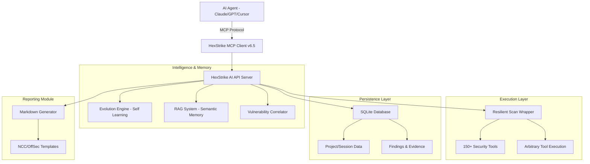

<div align="center">


# HexStrike AI MCP Agents v6.5 (Enhanced)
### AI-Powered Autonomous Cybersecurity Platform with Persistence, RAG & Evolution

[](https://www.python.org/)
[](LICENSE)
[](https://github.com/adibirzu/hexstrike-ai-enhanced)
[](https://github.com/adibirzu/hexstrike-ai-enhanced)
[](https://github.com/adibirzu/hexstrike-ai-enhanced)

**Advanced AI-powered autonomous penetration testing framework with persistent storage, semantic search (RAG), and a self-evolving tool execution engine.**

[🚀 Installation](#installation) • [🏗️ Architecture](#architecture-overview) • [🧬 Evolution Engine](#evolution-engine) • [📝 Reporting](#reporting) • [🤖 AI Agents](#ai-agents) • [📡 API Reference](#api-reference-v2)

</div>

---

## What's New in v6.5 (Enhanced)

HexStrike AI Enhanced v6.5 introduces significant architectural upgrades focused on autonomy, persistence, and intelligence:

*   **🧬 Evolution Engine**: Dynamically learn and execute any command-line tool on the system.
*   **💾 Persistent Layer**: SQLite-backed storage for projects, sessions, scans, and findings.
*   **🧠 RAG Integration**: Semantic search across past findings using ChromaDB and vector embeddings.
*   **🔄 Checkpoint System**: Resume long-running scans from the last saved state.
*   **📊 Pro Reporting**: Automated generation of professional pentesting reports (NCC Group & OffSec styles).
*   **⚡ Token Optimization**: Intelligent context compression and incremental updates to save LLM tokens.

---

## Architecture Overview

HexStrike AI Enhanced features a multi-layered autonomous architecture inspired by NeuroSploit and Pentest-AI.



---

## Installation

### Automated Setup (Recommended)

The easiest way to install HexStrike AI Enhanced and all its dependencies (including core security tools) is using the automated installer:

```bash
git clone https://github.com/adibirzu/hexstrike-ai-enhanced.git
cd hexstrike-ai-enhanced
chmod +x install.sh
./install.sh
```

The installer will:
1. Create necessary directory structures.
2. Set up a Python virtual environment.
3. Install all dependencies (including RAG and ML libraries).
4. Initialize the persistent SQLite database.
5. Check and install missing security tools (requires sudo).

---

## Evolution Engine

HexStrike can now "evolve" by learning new tools on the fly. If you have a custom security tool installed, HexStrike can learn how to use it autonomously.

1. **Discovery**: AI triggers `learn_new_tool("mytool")`.
2. **Learning**: HexStrike reads the man pages, help menus, and version info.
3. **Execution**: AI uses `execute_arbitrary_tool("mytool", ["--flag", "target"])`.
4. **Correlation**: Outputs are automatically correlated to suggest the next attack vector.

---

## Reporting

Generate professional reports directly from your workspace findings:

```bash
# Via MCP Tool
generate_report(project_id="uuid", template="ncc")
```

Available Templates:
*   `standard`: Comprehensive HexStrike assessment.
*   `ncc`: Inspired by NCC Group's technical report style.
*   `offsec`: Inspired by Offensive Security's penetration test style.

---

## API Reference (v2)

### Projects & Sessions
| Endpoint | Method | Description |
|----------|--------|-------------|
| `/api/v2/projects` | POST | Create a new security project |
| `/api/v2/projects` | GET | List all projects |
| `/api/v2/sessions` | POST | Start a tracked session |

### Evolution & Execution
| Endpoint | Method | Description |
|----------|--------|-------------|
| `/api/v2/evolution/learn` | POST | Dynamically learn a system tool |
| `/api/v2/evolution/execute` | POST | Execute any tool with auto-correlation |
| `/api/v2/evolution/learned` | GET | List all learned tools |

### RAG & Intelligence
| Endpoint | Method | Description |
|----------|--------|-------------|
| `/api/v2/rag/query` | POST | Semantic search across findings |
| `/api/v2/rag/context` | POST | Get enriched context for a target |

---

## Security Considerations

⚠️ **Important Security Notes**:
- **Isolated Environments**: Always run HexStrike in a dedicated security testing VM (Kali Linux recommended).
- **Tool Oversight**: AI agents can execute powerful system tools; monitor the real-time dashboard.
- **Data Protection**: Sensitive findings are stored locally in `data/hexstrike.db`. Ensure this directory is protected.

### Legal & Ethical Use
HexStrike AI Enhanced is intended for **authorized penetration testing** and **security research** only. Unauthorized use against systems you do not own or have explicit permission to test is illegal.

---

## Author
**adibirzu** - [GitHub](https://github.com/adibirzu)

**m0x4m4** - Original HexStrike v6.0 Author

---

**Made with ❤️ for the AI Security Community**
